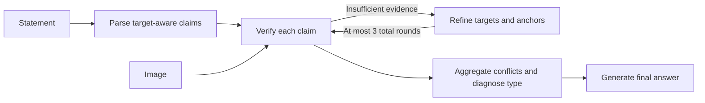

# LogicCon

**From Structured Facts to Logical Conflicts: A Benchmark and Framework for Visual-Text Conflict**

[中文说明](README_CN.md) · [Method](docs/method.md) · [Evaluation](docs/evaluation.md) · [Configuration](docs/configuration.md)

LogicCon checks visual–textual conflicts through target-aware claim parsing, visual verification, iterative evidence supplementation, conflict aggregation, and a final structured answer. The framework operates at inference time with one backbone vision-language model. Its inputs are an image and a statement.



The repository provides local Transformers and compatible HTTP backends, five cumulative ablations, independent semantic evaluation, resumable runs, and dataset sharding.

## Install

Python **3.11+** is required. For local CUDA inference:

```bash
git clone https://github.com/changcv2021/LogicCon.git
cd LogicCon
python -m venv .venv
source .venv/bin/activate
python -m pip install torch==2.8.0 torchvision==0.23.0 --index-url https://download.pytorch.org/whl/cu126
python -m pip install -r requirements-inference.txt
python -m pip check
```

For the HTTP backend, evaluation, and software tests, the core has no third-party runtime dependencies:

```bash
python -m pip install -e .
```

Use the PyTorch wheel index appropriate for your CUDA environment. Dependency versions are in `requirements-inference.txt`; record your fully resolved environment with `python -m pip freeze > requirements.resolved.txt`.

## Prepare inputs

Each input line has **exactly three fields**:

```json
{"sample_id":"example-001","image":"images/photo.jpg","statement":"The cup to the left of the plate is red."}
```

Images use paths relative to `--image-root`. Place the JSONL at `inputs/test.jsonl` and the referenced image at `images/photo.jpg`, for example. Labels, source questions, scene graphs, and mutation records are supplied only to the independent evaluator.

The [LogicCon dataset](https://huggingface.co/datasets/benchmarkanon/logic_conflict) provides the corresponding benchmark input format. An extracted offline bundle can be used directly with `--inputs /path/to/LogicCon/inputs/test.jsonl --image-root /path/to/LogicCon`.

## Run the method

Prepare a local Qwen2.5-VL model snapshot, then set its location:

```bash
export LOGICCON_MODEL_PATH=/path/to/Qwen2.5-VL-7B-Instruct

logiccon-reason validate-config --config configs/reasoning/qwen2_5_vl_7b.toml
logiccon-reason doctor --config configs/reasoning/qwen2_5_vl_7b.toml

logiccon-reason infer \
  --config configs/reasoning/qwen2_5_vl_7b.toml \
  --inputs /path/to/LogicCon/inputs/test.jsonl \
  --image-root /path/to/LogicCon \
  --output runs/qwen7b-full \
  --mode full
```

`python -m logiccon.reasoning` is equivalent to `logiccon-reason`. Models load from local files by default. The HF adapter uses `AutoModelForImageTextToText`, a native chat template, SDPA, and greedy decoding. Configurations are included for Qwen2.5-VL 7B/32B and HF-converted LLaVA-1.5. Use an approved GPU allocation on shared HPC systems; the CLI blocks bulk work on login hosts.

For a short execution, add `--limit 4` and use a separate output directory. This is a prefix-based smoke run, not random sampling. Append `--resume` to continue the same configuration without repeating completed samples.

## Ablations

| `--mode` | Enabled stages |
|---|---|
| `base` | Direct image–statement response |
| `parsing` | Claim parsing → response |
| `verification` | Claim parsing → visual verification/refinement → response |
| `aggregation` | Claim parsing → visual verification/refinement → aggregation |
| `full` | Claim parsing → visual verification/refinement → aggregation → final answer |

Give every mode a separate output directory. Keep the backbone, input selection, decoding parameters, and judge fixed for comparisons. The full method allows **3 total verification rounds per claim**, including the initial round; decisive evidence stops refinement early.

## Outputs

| File | Contents |
|---|---|
| `predictions.jsonl` | Labels, conflict types, target/claim/evidence, uncertainty, verification history |
| `events.jsonl` | Original model responses, prompts, token usage, timing, validation errors |
| `manifest.json` | Configuration, input/code hashes, model metadata, environment and shard selection |
| `summary.json` | Completed/failed/missing counts and uncertainty statistics |

Predictions use `consistent` / `conflicting` and five conflict types: `attribute`, `object`, `relation`, `spatial`, `quantity`. A semantic evaluation measures target object (TO), textual claim (TC), visual evidence (VE), and their conjunction (CP). See [evaluation instructions](docs/evaluation.md).

## Parallel execution

Run independent processes or scheduler array elements with the same `--num-shards N`, different `--shard-index` values, and separate output directories. Merge all completed shards:

```bash
logiccon-reason merge --runs runs/full/shard-0 runs/full/shard-1 \
  --output runs/full/predictions.jsonl
```

For Slurm, use [the parameterized launcher](scripts/slurm_infer.sh). Resource requests come from the caller and the site's current limits.

## Development and citation

```bash
python -m unittest discover -s tests -v
```

Tests use small scripted fixtures to check orchestration, evidence handling, schema validation, restart behavior, metrics, and HTTP serialization. The [GitHub Actions template](ci/tests.yml) runs these without models, GPU access, or API credentials. See [ci/README.md](ci/README.md) to enable it.

Citation metadata is in [CITATION.cff](CITATION.cff). Code is distributed under [CC BY 4.0](LICENSE); model weights and benchmark images retain their respective upstream terms and are obtained separately. See [NOTICE.md](NOTICE.md).
